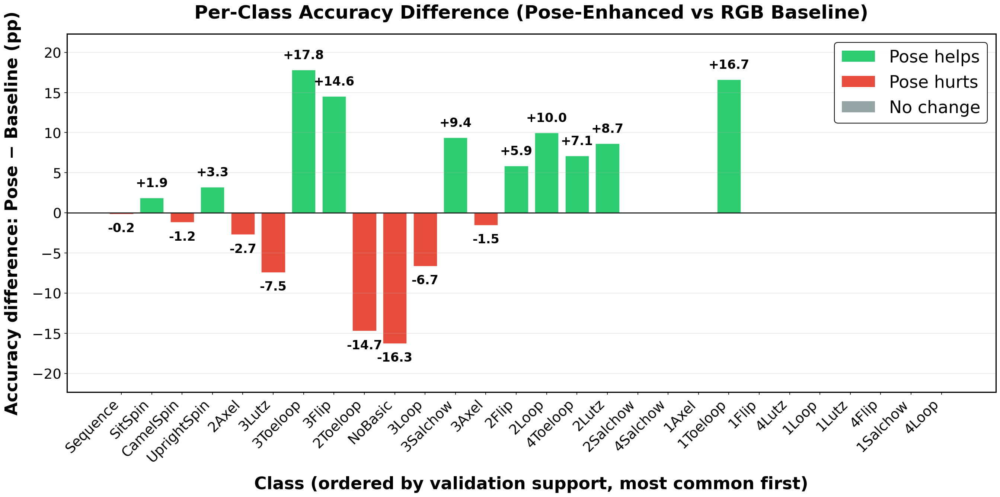
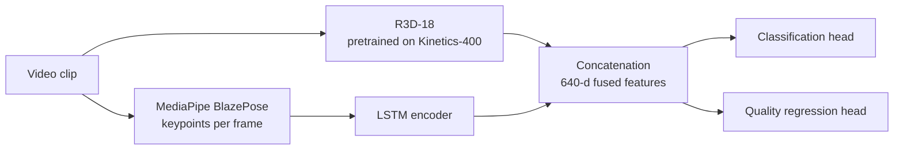
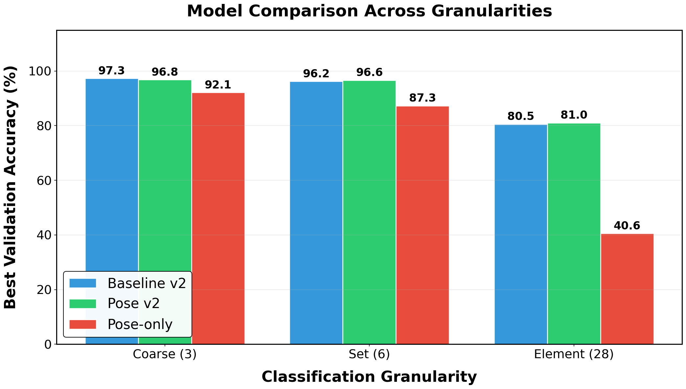
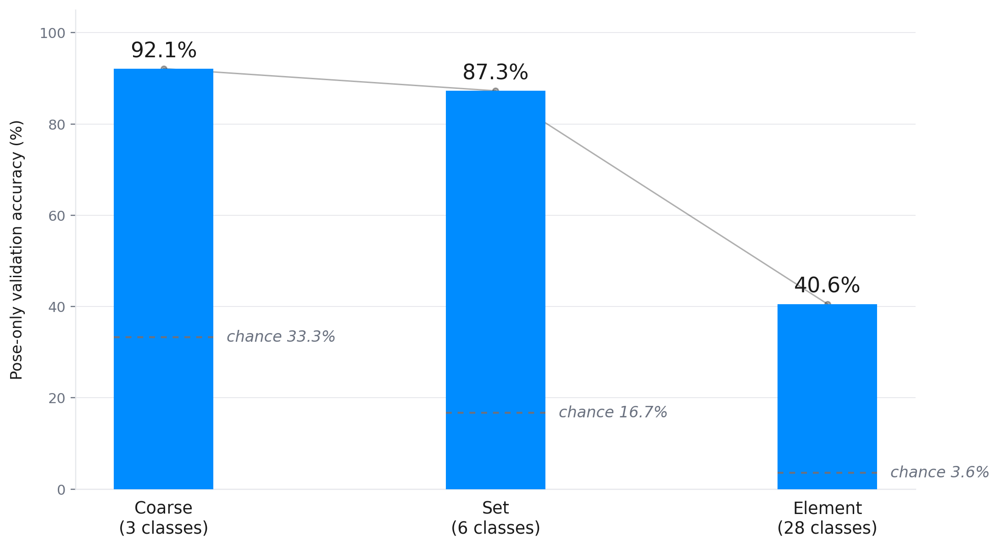

# Figure Skating Action Recognition with Pose-Based Enhancement

Does adding explicit skeletal pose information help a video model recognise figure skating elements? This project builds a dual-pathway deep learning system to test that question rigorously, across 18 trained models, a multi-seed stability study and five ablations.

## Key finding

Pose enhancement does **not** produce a statistically significant aggregate improvement at any granularity. At the element level (28 classes) the pose-enhanced model gains 0.47 percentage points over the RGB baseline, against a seed-to-seed noise floor of 0.39 pp measured across three seeds. A Wilcoxon signed-rank test gives p = 0.324 and the bootstrap 95% confidence interval crosses zero.

The aggregate number hides something more interesting: per-class analysis shows pose information redistributes errors between classes rather than failing uniformly, helping some element types while hurting others. The value of the project is in bounding the effect properly rather than reporting a single lucky run.



## Architecture



- **RGB pathway:** R3D-18 3D CNN, pretrained on Kinetics-400, fine-tuned on skating clips.
- **Pose pathway:** BlazePose keypoints extracted per frame, encoded temporally by an LSTM.
- **Fusion:** concatenation into a 640-dimensional representation feeding two heads, action classification and a multi-task execution-quality regression head.

## Evaluation

Evaluated on the [SkatingVerse](https://www.kaggle.com/datasets/elephantfish/skating-train-val) dataset (~20,000 clips) at three levels of granularity:

| Level   | Classes | Description                        |
|---------|---------|------------------------------------|
| Coarse  | 3       | jumps, spins, step sequences       |
| Set     | 6       | element families                   |
| Element | 28      | individual elements                |

Each level is trained as an RGB-only baseline and as the pose-enhanced dual-pathway model.



### Ablations

| ID | Change                                     | Question it answers |
|----|--------------------------------------------|---------------------|
| A1 | Pose-only (RGB pathway disabled)           | How much signal does pose carry on its own? |
| A2 | No inverse-frequency class weighting       | How much does imbalance handling matter? |
| A3 | No quality regression head                 | Does multi-task learning help classification? |
| A5 | Late logit fusion instead of concatenation | Is the result sensitive to fusion strategy? |

Per-class F1 results for each ablation are in [`results/`](results/).



## Repository structure

```
src/            Core pipeline: data preparation, pose extraction, training, analysis
experiments/    Later model iterations (v2, v3) used for the final experiments
results/        Summary metrics and per-class F1 CSVs
figures/        Key plots from the dissertation
```

## Reproducing the experiments

Trained checkpoints and the dataset are not included; everything can be reproduced from the scripts.

### Environment

Python 3.12 is required (MediaPipe 0.10.14 does not support 3.13). A CUDA GPU is strongly recommended.

```bash
conda create -n skating python=3.12
conda activate skating
pip install -r requirements.txt
cd src
```

### 1. Prepare the dataset

Download SkatingVerse from Kaggle, then:

```bash
python reorganise_dataset.py --input <path_to_skatingverse> --granularity element
python reorganise_dataset.py --input <path_to_skatingverse> --granularity coarse
```

### 2. Extract pose features

```bash
python extract_poses.py --data_dir dataset_element --output_dir poses_element
```

### 3. Train

```bash
python skating_action_recognition.py --granularity element   # RGB-only baseline
python train_pose_model.py --granularity element             # pose-enhanced
```

Repeat with `--granularity coarse` for the 3-class experiments. Ablations are enabled with flags on `train_pose_model.py`: `--pose_only` (A1), `--no_class_weights` (A2), `--no_quality_head` (A3), `--fusion late` (A5).

### 4. Analysis and figures

```bash
python analysis.py --base_dir . --val_video dataset_element/val --val_pose poses_element/val
python plot_comparison.py
```

`analysis.py` writes figures and CSVs to `./analysis/`. Confusion matrices are only produced when `--val_video` and `--val_pose` are supplied. Scripts expect input and output folders to sit alongside them.

## Tech stack

Python, PyTorch, torchvision (R3D-18), MediaPipe, LSTM sequence modelling, NumPy, SciPy, Matplotlib. Trained on an RTX 3060 locally and RTX 4090 instances on RunPod.
